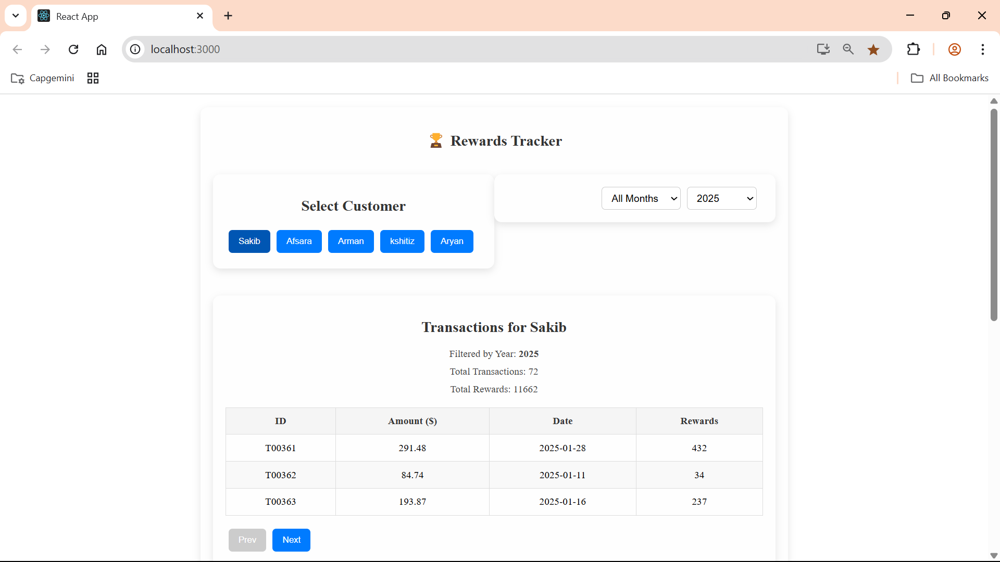
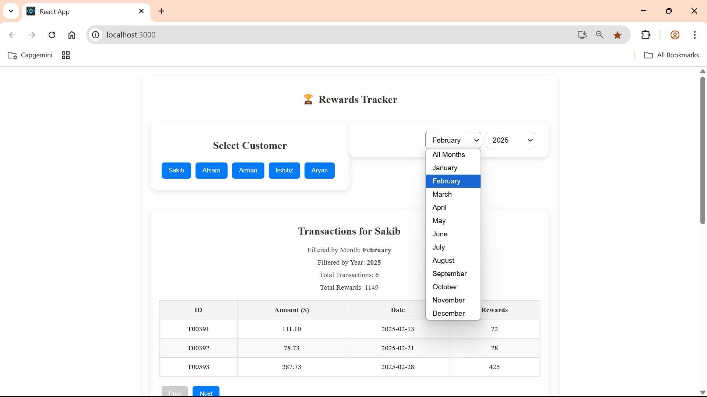
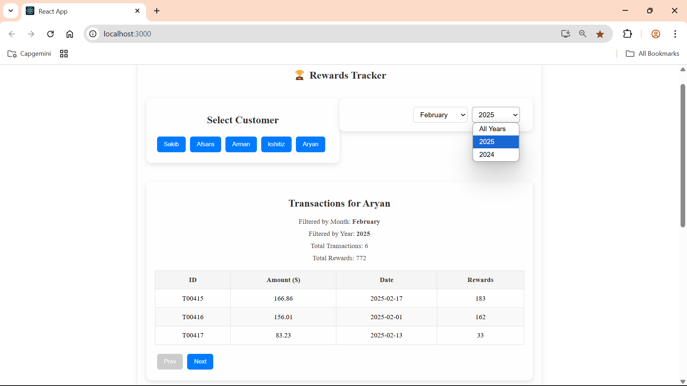
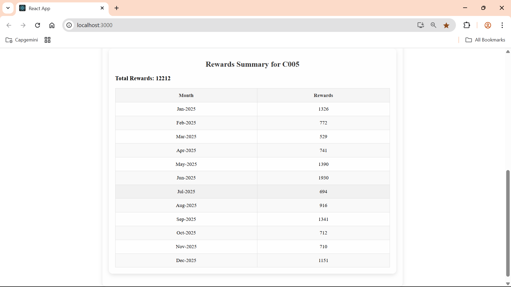
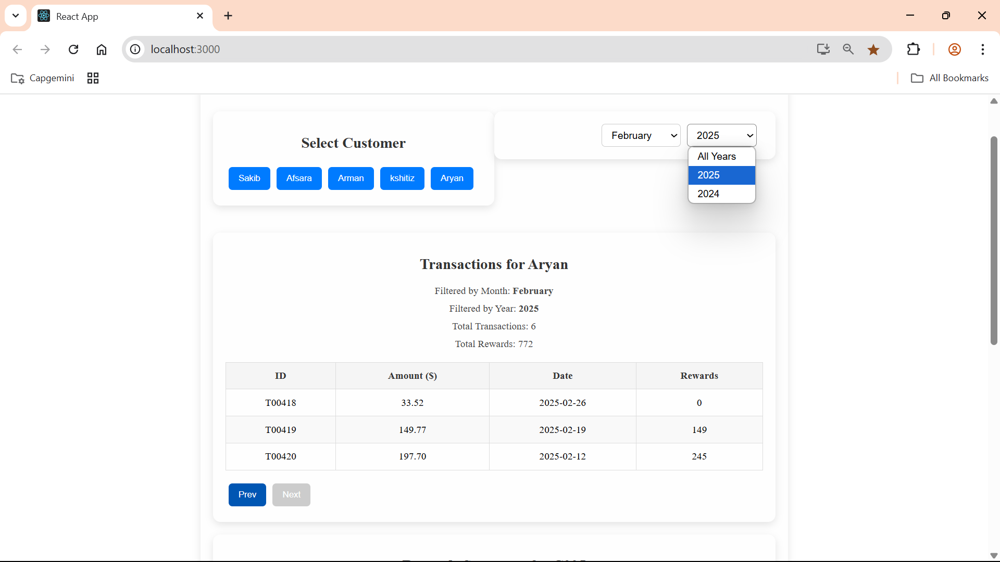

# 🏆 Customer Rewards Program (React JS)

This project is a React JS application that simulates a rewards program for a retailer. The application calculates reward points earned by customers based on their purchase transactions and displays a summary and detailed breakdown of rewards per customer, per month.

---

## 📌 Features

- ✅ **Reward Calculation Logic**
  - Customers earn:
    - **2 points** for every dollar spent over **$100**
    - **1 point** for every dollar spent between **$50 and $100**
    - E.g., a $120 purchase earns **90 points** (2×20 + 1×50)
- ✅ **Async API Simulation**
  - Fetches transactions using a simulated API call with loading and error handling.
- ✅ **Customer Selection**
  - Shows reward summary of all customers by default.
  - Allows selecting a specific customer.
- ✅ **Month & Year Filters**
  - Filter dropdowns for last 3 months (default) and year selection (2025 by default).
- ✅ **Pagination**
  - Paginated transaction details view.
- ✅ **Styled Components**
  - Clean and modular UI styling using styled-components.
- ✅ **Unit Tests**
  - Test cases included with `@testing-library/react` and `jest`.
  - Covers positive and negative cases, including fractional and whole amounts.
- ✅ **React Best Practices**
  - Component-level file organization (`lowerUpperCase.js`)
  - Prop validations, transaction logging
  - Code splitting
  - Data handled dynamically (no static data)
- ✅ **Responsive Design**
  - Works on all modern screen sizes.

---

## 🗂️ Project Structure

```
src/
│
├── api/
│   └── fetchTransaction.js         // API mock to fetch transaction data
│
├── components/
│   ├── customerList.js             // Lists all customers
│   ├── transactionSummary.js       // Reward summary view
│   ├── transactionDetails.js       // Transaction detail table
│   └── filterSection.js            // Dropdown filters for month & year
│
├── data/
│   └── mockData.json               // JSON mock data
│
├── styles/
│   └── stylesComponents.js         // All styled components
│
├── App.js
└── index.js
```

---

## 🔍 Mock API Data

The mock API returns an array of transactions with the following structure:

```json
{
  "transactionId": "TXN123",
  "customerId": "CUST001",
  "customerName": "Sakib Khan",
  "amount": 120.5,
  "date": "2025-02-15"
}
```

---

## 📊 Rewards Calculation

```js
const calculateRewards = (amount) => {
  let rewards = 0;
  if (amount > 100) {
    rewards += (amount - 100) * 2;
    amount = 100;
  }
  if (amount > 50) {
    rewards += (amount - 50) * 1;
  }
  return Math.floor(rewards);
};
```

---

## 🧪 Testing

Tested with **Jest** and **React Testing Library**.

- ✅ Fetch and render customer list
- ✅ Handle API error and loading state
- ✅ Trigger customer selection
- ✅ Filter by month/year
- ✅ Handle pagination
- ✅ Edge cases for reward calculation (e.g. $49.99 = 0 pts, $50 = 0 pts, $150 = 150 pts)

📁 Test files are under `/__tests__/` and named as `component.test.js`.

ScreenShots-----

SCREENSHOTS ------





